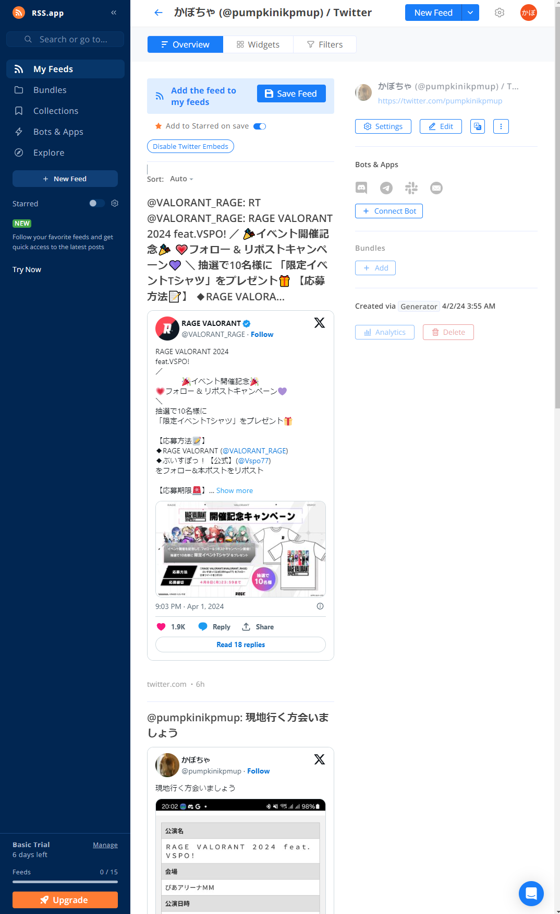
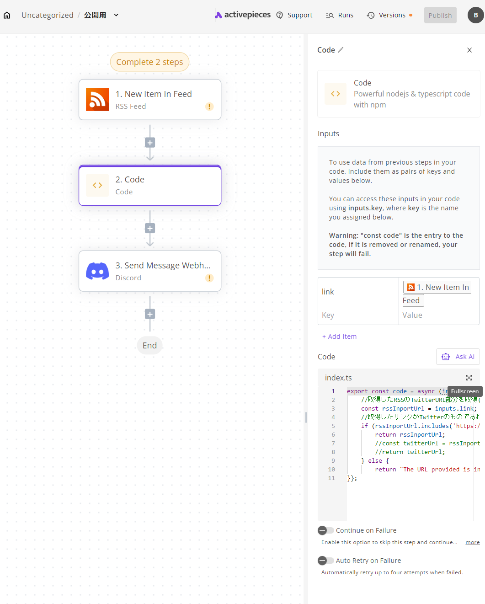

# DiscordBotの作成方法（Xのポスト通知）
Discordの任意のテキストチャンネルにBotとして特定ユーザのポストを送信するBotの作成方法です<br>
言語化が苦手のためなるべくスクリーンショット等を用いて説明をしていますが、画像内の注釈等を入れるのが面倒だったため余計わかりにくかったらごめんなさい。
## 性能
- ここで紹介するツールのRSSの更新が15分から30分くらい、Flowsの更新が15分周期のため大体1時間くらいの遅延があります
- Discordの設定-詳細設定から開発者モードがオンになっているかを確認してください
## 使用ツール
- Discord
- RSS.app<br><https://rss.app/ja>
    - Xのポストを取得する際に使用するツール、外部ツールのためサービスが終了可能性あり
- Flows<br><https://cloud.activepieces.com/sign-in>
    - RSS.appで取得したポストのデータに更新があった際にDiscordのbotを通じてメッセージを送信する等のフローを作成できるツール
    - Botを簡単に作成できるためのフローを事前に用意してあるのでご使用ください。（Xポスト通知DiscordBot公開用.json）
- Discord開発者ツール
    - DiscordBotを作成する際に必要になるトークンを発行するために使用<br><https://discord.com/developers/applications?new_application=true>
## RSS.app
- まずはログインまたはサインイン
- 右上のNewFeedで新規作成→Twitter RSS Feed→少し下にGenerate RSS Feed of a Twitter User Feedがあるのでそこにポストの通知を呼びたいアカウントのIDを入力し、Generate

- Generateに成功するとこのような画面になっているはずです。取得したいアカウントになっていればSortをLasd addedにしてSaveFeedをクリック

- ここまでくるとXMLをコピーできるはずです。（現時点のバージョンだと画像の上部付近、時期によって変わるのでこれは探して下さい）これをコピーしたものをFlowsで使用します。

##　Flows
- これもログインまたはサインイン
- Import FlowにXポスト通知DiscordBot公開用.jsonを使用する
- 1.New Item In Feed(RSS Feed)
    - Trigger-New Item In Feed
    - RSS Feed URL-RSS.appでコピーした.xmlのリンクを張り付け(赤の部分)
- 2.Code(ここはすでに入力されているはずなのでここのJSONファイルを使用した方は基本的には触らなくてよいはずです)
    - +Add Itemをクリックし、Keyにlink,Valueに1.New Item In Feedを入力
    - Twitterのリンクを返却するコードを入力
        - ここのコードのコメントアウトにも書かれていますが、なぜかinputs.link.linkでしかRSSのTwitterURL部分を取得できないときがあります。<br>
        テスト段階で実行がうまくできていない場合は3行目を<br>
        const rssInportUrl = inputs.link;→const rssInportUrl = inputs.link.link;<br>
        に変更してみてください。
    ```
    export const code = async (inputs) => {
    //取得したRSSのTwitterURL部分を取得(※inputs.link.linkにしないと取得できないケースあり)
    const rssInportUrl = inputs.link;
    //取得したリンクがTwitterのものであればリンクを返却
    if (rssInportUrl.includes('https://twitter.com/')) {
        return rssInportUrl;
        //const twitterUrl = rssInportUrl.replace('https://twitter.com/', 'https://vxtwitter.com/');
        //return twitterUrl;
    } else {
        return "The URL provided is incorrect or has not been retrieved.";
    }};
    ```

- 3.Send Message Webhook
    - Connection
        - NewConnectionを押し、Nameは好きなように設定BotTokenにDiscord開発者ツールから取得したBot Tokenを張り付け
        - Discord developer portalに入る→Applications→NewApplication→名前は自由でOKです
        - 作成出来たらこのような画面になるはずです。
        - 上記の画面が出ていたならBotタブ→TOKENのResetTokenをクリックしてパスワード認証を行うとBotTokenをコピーできるようになるはずなので貼り付け
    - Webhook URL
        - 通知を出したいDiscordのテキストチャットの設定を開く→連携サービスのウェブフックを作成
        - 名前とアイコンを自由に変更してウェブフックURLをコピーして貼り付け
    - Message
        - Codeを選択
- 実行確認
    - ここまで出来たらTest flowをクリック、問題なければBotが何かを投稿しているはずです
    - 実行が出来ていたら上側にあるPublishをクリック（サンプルのフローのスクリーンショットなのでグレーになってますが実行できていたらクリック出来ます）
    - くわしく確認したい人、エラーが出た人向け
        - 各フロー（1~3）にLoad dataやRetestが存在するはずなのでそれをクリックしてそれぞれのフローを確認する

